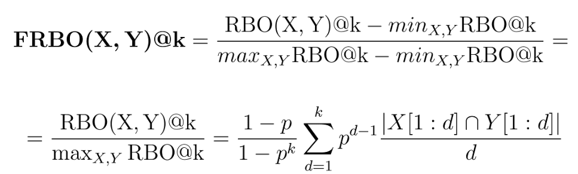

# Investigating the Robustness of Sequential Recommender Systems Against Training Data Perturbation - ECIR 2024

Code for the paper:\
[Investigating the Robustness of Sequential Recommender Systems Against Training Data Perturbations](https://arxiv.org/pdf/2307.13165.pdf)\
**Authors:** Filippo Betello, Federico Siciliano, Pushkar Mishra, and Fabrizio Silvestri\
Accepted at the 46th European Conference on Information Retrieval (ECIR) 2024 

**Abstract**:\
Sequential Recommender Systems (SRSs) are widely employed to model user behavior over time.
However, their robustness in the face of perturbations in training data remains a largely understudied yet critical issue.
A fundamental challenge emerges in previous studies aimed at assessing the robustness of SRSs: the Rank-Biased Overlap (RBO) similarity is not particularly suited for this task as it is designed for infinite rankings of items and thus shows limitations in real-world scenarios. For instance, it fails to achieve a perfect score of 1 for two identical finite-length rankings.
To address this challenge, we introduce a novel contribution: Finite Rank-Biased Overlap (FRBO), an enhanced similarity tailored explicitly for finite rankings. This innovation facilitates a more intuitive evaluation in practical settings.
In pursuit of our goal, we empirically investigate the impact of removing items at different positions within a temporally ordered sequence.
We evaluate two distinct SRS models across multiple datasets, measuring their performance using metrics such as Normalized Discounted Cumulative Gain (NDCG) and Rank List Sensitivity.
Our results demonstrate that removing items at the end of the sequence has a statistically significant impact on performance, with NDCG decreasing up to 60\%. Conversely, removing items from the beginning or middle has no significant effect.
These findings underscore the criticality of the position of perturbed items in the training data. As we spotlight the vulnerabilities inherent in current SRSs, we fervently advocate for intensified research efforts to fortify their robustness against adversarial perturbations.

## Motivation:
In Sequential Recommendation, each user $u$ is represented by a temporally ordered sequence of items $S_u = (I_1, I_2, ..., I_j, ..., I_{L_u-1}, I_{L_u})$ with which it has interacted, where $L_u$ is the length of the sequence for user $u$. 
User-object interactions in real-world scenarios are often fragmented across services, resulting in a lack of comprehensive data. For example, in the domains of movies and TV shows, a single user may interact with content on TV, in a movie theater, or across multiple streaming platforms. To mimic this real-world scenario in our training data perturbations, we considered three different cases, each removing $n$ items at a specific position in the sequence:
- **Beginning**: $S_u = (I_{n+1}, \dots, I_{L_u-1})$. This represents a user who signs up for a new service, so all his past interactions, i.e., those at the beginning of the complete sequence, were performed on other services.
- **Middle**: $S_u = (I_1, \dots,I_{\left\lfloor\frac{L_u-1-n}{2}\right\rfloor},I_{\left\lfloor\frac{L_u-1+n}{2}\right\rfloor} ..., I_{L_u-1})$. This represents a user who takes a break from using the service for a certain period and resumes using it. Still, any interactions they had during the considered period are not available to the service provider.
- **End**: $S_u = (I_1, \dots, I_{L_u-1-N})$. This represents a user who has stopped using the service, so the service provider loses all the subsequent user interactions. The service provider still has an interest in winning the user back through their platform or other means, such as advertising. Thus, it is essential to have a robust model to continue providing relevant items to the user.
## Experiments:
We used [RecBole](https://github.com/RUCAIBox/RecBole) library to validate our hypotheses: we used two architectures, **SASRec** and **GRU4Rec**, which operate differently, making it particularly interesting to evaluate their behavior under training perturbations.<br><br>
We used four different datasets: **MovieLens 100k**, **MovieLens 1M**, **Foursquare New York City** and **Foursquare Tokyo**.<br>
We select datasets widely used in the literature and with a high number of interactions per user.
The limitation in dataset selection arises from our intention to assess the robustness against the removal of up to 10 elements.
Therefore, the dataset must satisfy the following constraint: $L_u > 10 \quad \forall u \in U$,
where $L_u$ is the number of interactions of user $u$, i.e. the length of the sequence $S_u$ of interactions, and $U$ is the set of all users in the dataset.
If the condition is not met, we delete all the items for a user with less than ten interactions. In this case, we cannot train the model on this particular user.

## FRBO:


In the domain of recommendation systems, it is customary to compute metrics using finite-length rankings, typically denoted by appending _@k_ to the metric's name, such as NDCG@k. While traditional metrics (e.g. NDCG, MRR, etc.) readily adapt to finite-length rankings, maintaining their core meaning, the same behaviour does not extend to RLS when employing RBO. The reason lies in the equation of RBO, which exhibits a notable limitation: it fails to converge to one, even when applied to identical finite-length lists. To overcome this limitation, we introduce the Finite Rank-Biased Overlap (FRBO) similarity, denoted as $\mathrm{FRBO@k}$, which represents a novel formulation engineered to ensure convergence to a value of 1 for identical lists and a value of 0 for entirely dissimilar lists.

## Results:
### Variation of metrics between two seeds

It can be seen that in general the discrepancy is negligible, almost always less than 1%. On the other hand, the two RLS, calculated using FRBO and Jaccard respectively, show us the similarity between the two rankings produced with different initialization seeds. The results deviate significantly from the ideal value of 1, indicating considerably different rankings. 

### Variations in metrics for ten-item removal

It’s observed that discarding items from the beginning or middle of the sequence does not significantly impair the model’s performance; only a minor decline is noted, potentially attributable to the marginally reduced volume of total training data. Instead, it can be observed how removing items from the end of the sequence leads to a drastic reduction in metrics. <br>
Moreover, removing items at the end of the sequence leads to considerable variation in the rankings produced by the models (see RLS metrics). The values approach 0, meaning that the produced rankings share almost no items.

### Number of elements removed

Removing elements that are at the beginning or in the middle of the temporally ordered sequence has no effect on performance.<br>
For the remaining setting, the one where we remove items at the end of the sequence, the effect of the number of items removed is evident: the metrics drop drastically as the number of items removed increases.

## If you use any part of this code please cite us
```
@inproceedings{betello2024investigating,
  title={Investigating the Robustness of Sequential Recommender Systems Against Training Data Perturbations},
  author={Betello, Filippo and Siciliano, Federico and Mishra, Pushkar and Silvestri, Fabrizio},
  booktitle={European Conference on Information Retrieval},
  pages={205--220},
  year={2024},
  organization={Springer}
}
```
